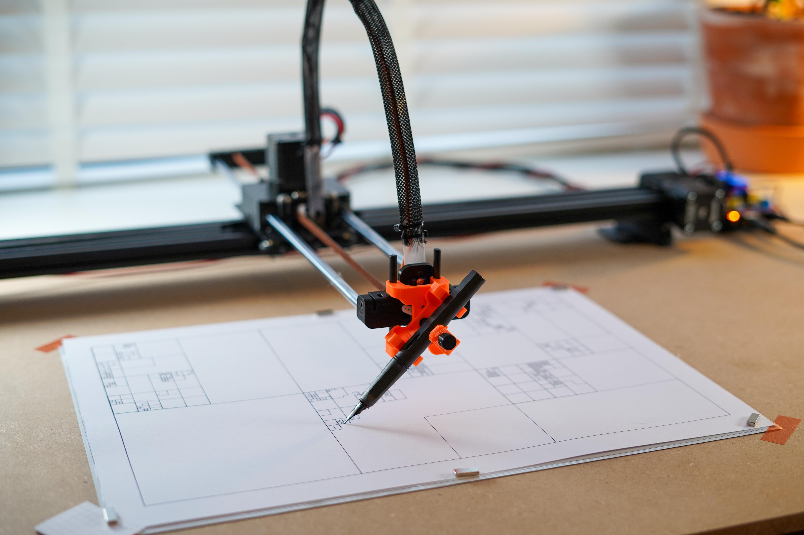
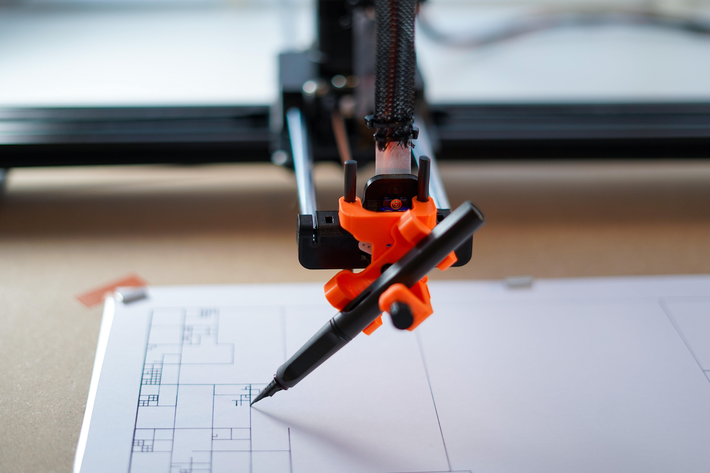
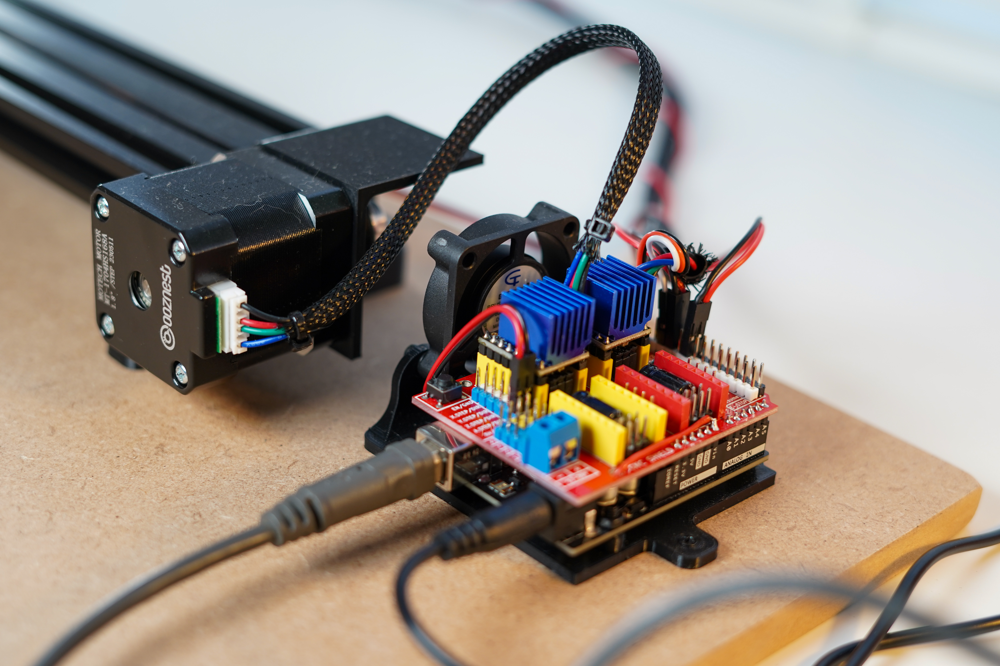
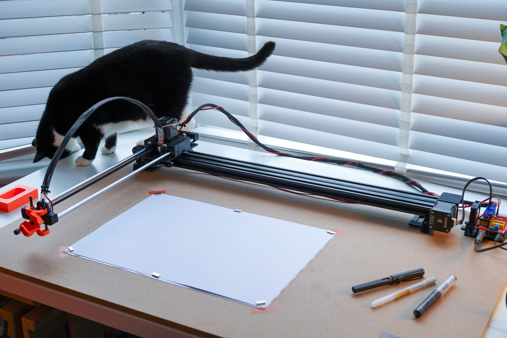

# plotter, a robot that draws

notes from building and setting up a DIY pen plotter



## Building the plotter

### what?

I've used the X-Y plotter (like the Axidraw/Next draw) [designed by Andrew Sleigh (v3)](https://andrewsleigh.github.io/plotter/). The design is simple, and the build was easy enough to work out. Andrew's design and guide is _excellent_. There isn't more I need to add really, go and build it!

### reflections

- I 3D printed the parts (PLA seems fine) ~and opted for a 700mm v-slot X-axis, and a 500mm linear rails Y-axis. This gives me a working plotting area of about 420mm x 300 mm, which is frustratingly way too big for A3, and just a bit short to print A2 sized-plots.~ \[EDIT: I have now rebuilt this with an 800 mm v-slot for the X-axis, and 600 mm linear rods for the Y-axis. This now accomodates A2-sized paper (420 x 594 mm). The Y-axis droop isn't as bad as I had feared.\]

- I have noticed some slight 'drooping' on the Y-axis arm, so going beyond the current size might cause problems there. If I do need to scale up, I might look at an H-system design, as seen in the [ACRO](https://www.instructables.com/ACRO-Openbuilds-Pen-Plotter-Arduino-With-GRBL-and-/), Unatek, and more recently, the Bantam ArtFrame designs.

- The BOM on Sleigh's post is good. In the UK, I purchased most parts from <https://ooznest.co.uk>. I would guess that the whole build cost me under £150 (2024)?

- Don't underestimate the amount/type/colour bolts you need.

- I _hate_ doing Dupont crimps by hand, but I hate the idea of buying a tool more.

### arduino + shield + drivers

The plotter runs off an Arduino (Elegoo R3) with a CNC shield (protoneer clone). It's running GRBL, controlled with G-code, like a CNC machine. On the CNC shield, I opted for TMC2208 motor drivers with NEMA17 Stepper Motors (1.8° 77oz - probably overkill), and I'm really happy with the lower noise and performance so far. I [dialled the Vref](https://all3dp.com/2/vref-calculator-tmc2209-tmc2208-a4988/) down to about 0.8V on each driver (ymmv) and with the fan and heatsinks it seems happy. Before that, the drivers and motors got a bit warm during a plot.

For the CNC shield, note that you'll need to make a small modification in order to draw 12V power from the Arduino to power the motors, rather than use a second power supply. Sleigh mentions it in the guide, but don't overlook it.

### modifications

[Sleigh's design](https://andrewsleigh.github.io/plotter/) worked brilliantly for me (apart from the Arduino box fit/print time), but I've made a few small modifications to the 3D printer parts:

- [**A new mounting bracket for the Arduino and CNC shield.** (STL file)](https://www.thingiverse.com/thing:6845447) - I found the original box didn't account for heat sinks, was fiddly to install and took a long time to print. I've opted for an open mount, with a bracket to hold a 40 mm fan pointed at the heat sinks which works well.
- [**Remixed Sleigh's pen holder design for fountain pens.** (STL files)](https://www.thingiverse.com/thing:6845438) - I've split this into two parts, allowing the pen-holder to rotate to 45 degrees. This allows it to be used with fountain pens, like the Axi/Next Draw. It's not perfect, I'll probably keep tweaking this. If you just want normal vertically mounted pens, use the Sleigh design.
- **Foot risers.** This was to give more space for vertically mounted pens when I was printing on a seperate board. Now that I've mounted the plotter on a large MDF sheet, the risers are probably unneccessary. Also, with 45 degree fountain pens, the gap is actually a bit big... so I'll probably remove these soon.



### limit switches

Not essential, but I've recently added (x2) limit switches to the 0 ends of my x and y axes so that I can home the plotter. This isn't essential and I'm not sure how much it helps. There's a bit of a confusion on the CNC shield, even though there's two jumpers (+ and -) for each axis limit switch... connecting both ends doesn't work. You need to wire the switches in series and just connect to one of the jumpers (and ground). The cabling started to get a bit messy with both ends' limit switches, so I've just opted for one switch per axis for now.

### grbl calibration settings for plotter

Once assesmbled, the plotter [needs calibrating](https://github.com/gnea/grbl/wiki/Grbl-v1.1-Configuration). Szymon Kaliski has some useful notes [here](https://szymonkaliski.com/writing/2023-10-02-building-a-diy-pen-plotter/#grbl). I found that [UGS](https://winder.github.io/ugs_website/) offers a helpful GUI wizard for calculating and setting things like travel resolution and limit/end-switches. You can also set these commands individually in the CNCJS console. This is obviously specific to every machine. As a starting point, my settings are here. (TOODO: add settings file)

### grbl (pen servo flavour)

It isn't vanilla grbl we're using here, instead one of the many pen-servo variants (I think I used [this one](https://github.com/bdring/Grbl_Pen_Servo), but I can't recall now.).
As outlined in the plotter design notes, you need to make a couple of modifications to the grbl library. I had to modify the pen-up/down positions in `spindle_control.c` before uploading to Arduino. Then in the gcode this equates to `Z0` = pen down, and `Z>0` = pen up

---

## Preparing to Plot - notes on my workflow

So the plotter is built, and everything is calibrated and tested. Pen and paper ready! How to plot?

1. Create your SVG in Processing/P5js/Inkscape.
2. Optimise SVG and convert to GCode with `vpype` and `vpype-gcode`.
3. Preview plot with vpype's `show` command instead of final output. E.g.: `vpype read input.svg linemerge linesort linesimplify show` to check it looks good
4. Plot! Send GCode to modified GRBL on Arduino/CNC shield, controlling the plotter (this has to be sent 'live', so make sure your computer doesn't sleep). I'm using [cncjs](https://cnc.js.org/) for this control.

#### exporting SVGs from p5js

P5js doesn't support SVG export natively. Until recently we had to use the p5.js-svg library which has been out of date for a while. Golan Levin has now come to the rescue with [P5.PlotSVG](https://github.com/golanlevin/p5.plotSvg) - SVG rendering, specifically for pen plotters! For the now depreciated use of exporting SVGs in p5js, [see here](P5js-plotting.md).

### command to convert .SVG into ready-to-print GCode

`vpype -c config.toml read --no-crop input.svg layout a4 pagerotate occult -i linemerge linesort linesimplify gwrite -p fast-plot output.gcode`

This loads the custom config .toml file, in your working directory. This is where I've set my plotter profiles which formats the gcode. [You can see an example of my config profile here](/thrly-config.toml) (my default is 'fast-plot')

## splitting a multi-coloured SVG into to multi-layer gcode

For the most part, you can use the [./ez-plot] shell script (remember to set your privileges with `chmod +x ./ez-plot`, and potentially move into your `usr/bin` first), then using with `ez-plot filename.svg [papersize]`
( Papersize defaults to A3 landscape. )

Sometimes you'll want to plot in multiple pens, colours, etc. To do that, you can split an SVG into multiple layers, each layer getting its own gcode to plot (be careful to align your pen nib for each layer...)
~In vpype, read the svg, splitting layers by stroke (`read -a stroke`), then delete all layers, keeping the one you want (`ldelete --keep 1`)~

~For example:~

~First, inspect your layers to see which is which (take note of the layer number):~

~`vpype read --no-crop -a stroke circle-packed.svg show`~

~Then run the command to render your gcode for the desired layer:~

~`vpype -c thrly-config.toml read --no-crop -a stroke circle-packed.svg layout -m 3cm 282x210mm pagerotate ldelete --keep 1 linemerge reloop linesort gwrite -p fast-plot circle-pack-layer-1.gcode`~

~Ensure that you delete the layers _after_ setting your layout/scale/position, otherwise the layers will be out of alignment with each other.~
~Then repeat for each layer.~

~\[EDIT, Nov '24: that said, I think I've had some problems recently with alignment between layers, so maybe something is off here?]~

UPDATE: the following seems like a better workflow for splitting all layers, rather than using `ldelete`:
`vpype -c thrly-config.toml read --no-crop filename.svg pagesize --landscape a3 linemerge reloop linesort forlayer gwrite -p fast2-plot "_name%_lid%.gcode" end`

Also, early testing suggests that adding the following to the gwrite profile config (.toml) helps with the "correct" layer alignment

```
invert_y = false
vertical_flip = true
```

## plotter in action (video)

[](https://www.youtube.com/watch?v=FBUoVaFsj6M)

---

## Summary of resources

- the **plotter** - <https://github.com/andrewsleigh/plotter/tree/master>
- my fountain pen holder - <https://www.thingiverse.com/thing:6845438>
- **grbl** pen servo, running on the arduin + cnc shield - download and install instead of vanilla GRBL (install in the same way) <https://github.com/bdring/Grbl_Pen_Servo/tree/master>
- **Processing** or **p5js** for designing generative stuff.
- Inkscape -- I'm not using it for design/layout, but its occasionally useful for debugging a weird SVG file.
- P5.PlotSVG - SVG rendering, specifically for pen plotters - <https://github.com/golanlevin/p5.plotSvg>
- ~P5.js-SVG library, because P5js doesn't actually support SVGs (only working with P5js v. 1.6.0)- <https://github.com/zenozeng/p5.js-svg>~ (depreciated in my recent workflow)
- **vpype** for optimising svg for plotting - <https://github.com/abey79/vpype>
- **vpype-gcode** (plugin) for converting svg to gcode - <https://github.com/plottertools/vpype-gcode>
- vpype **occult** (plugin) for hidden line removal
- **cncjs** - <https://cnc.js.org/>

## Reading list

[See here](readingList.md) for a list of useful pen-plotting / generative art writing, talks, blogs, etc.

## Future plans

- Redesign pen holder to make servo more easily replaceable
- Hook up a raspberry pi to run cncjs headless, so I can free up my computer and send plots over the network.


_Lilith vs the plotter_

I've been logging some of my plots on instagram: <https://www.instagram.com/ot.x.y/>

If you found any of this useful, please drop me a comment! 👋

Oliver

```

```
